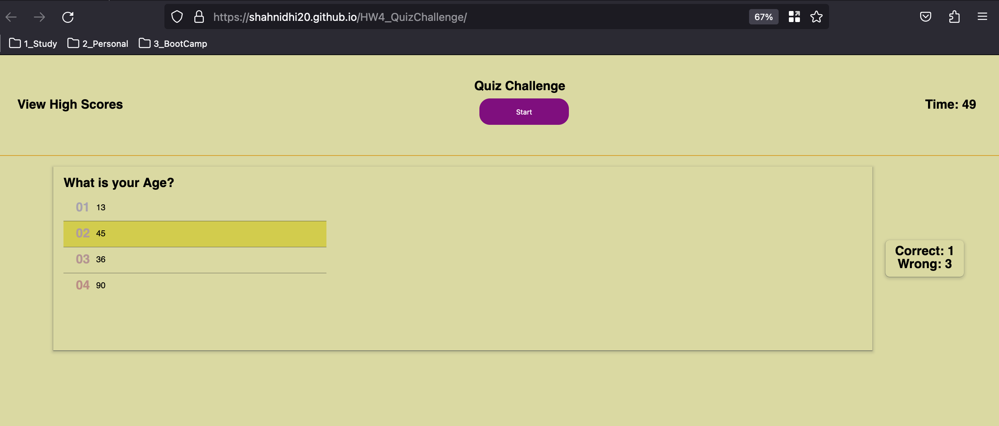

# HW4_QuizChallenge

   

     
   

## Description

    *Demonstrates the JS following features
        1. Updating the UI elements within Javascript
        2. Timer implementation
        3. Local Storage for storing the correct and wrong answers

## Getting Started

### Dependencies

NA

### Installing

- Clone the repo

### Executing program

NA

## Help

NA

## Authors

Nidhi Shah

## Version History

    0.1
        Initial Release

## License

NA

## Acknowledgments

    Refered following resources
    https://www.w3schools.com/js/
    https://developer.mozilla.org/en-US/docs/Web/JavaScript
